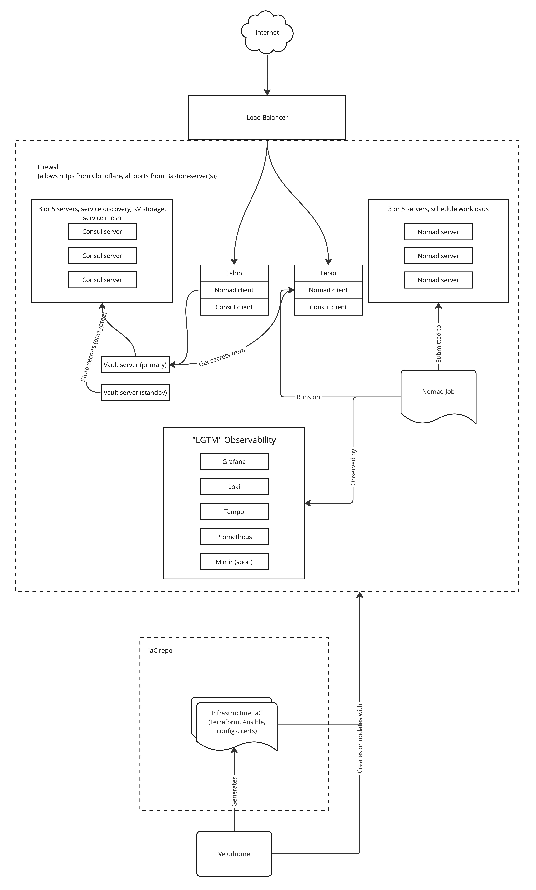

# Archived - see https://github.com/OpenPaasDev/core
This project is archived, but not dead, Please see [OpenPaas Core](https://github.com/OpenPaasDev/core) instead.
This project has picked the best parts out of this codebase, while making it less coupled to the HashiCorp stack, in light of the HashiCorp license change.

# OpenPaaS
Single-command: `openpaas sync --config.file config.yaml` that sets up a full _"Hashistack"_ cluster consisting of:
* Infrastructure 
    * Currently supports [Hetzner](https://www.hetzner.com)
    * Other clouds coming
    * Infrastructure:
        * Load Balancer
        * Firewalls
        * Private Networks
        * Servers
        * Volumes
* Hashistack cluster, secured with TLS & token ACL:
    * [Consul](https://www.consul.io) (networking, service discovery, service mesh)
    * [Nomad](https://www.nomadproject.io) (compute scheduling)
    * [Vault](https://www.vaultproject.io) (secrets management)
    * [Fabio LB](https://fabiolb.net/) ingress.
* Observability:
    * Grafana
    * Loki (logs)
    * Tempo (traces)
    * Prometheus (metrics)
    * Mimir (soon, long term metrics storage)

Networking is setup so your bastion host (`allowed_ips`) have full access to the cluster, while Cloudflare IPs have access to 443, exposed by `Fabio LB`.

Below is a reference architecture of what is created, and how it should be used. OpenPaaS concerns itself with the left side of the diagram, GitOps repo and operator is for you to implement (we may build something for this later):


# Pre-requisites
## Pre-requisite software
Your machine/operator node will need the following pre-installed (openpaas will check for presence before execution):
* `nomad`
* `consul`
* `vault`
* `ansible`(*Important!* 2.13 or higher, please verify, as lower versions are installed by some package managers)
* `terraform`
* `cfssl` & `cfssljson`

You probably want to also use [git secret](https://git-secret.io) to protect your `[base_dir]/secrets` directory in the generated files.
Additionally, [direnv](https://direnv.net) will make life easier, as `openpaas genenv --config.file [config]` will generate a direnv compatible `.envrc` file for you.

To ensure other env variables are preserved with `openpaas genenv`, just add this line into an existing `.envrc` file:

```
### GENERATED CONFIG BELOW THIS LINE, DO NOT EDIT!
```

## Other requirements
* An SSL certificate with cert and key-file uploaded to your Hetzner project.
    * ID of the SSL certificate, which can be extracted with Hetzners [hcloud](https://github.com/hetznercloud/cli)-CLI, with `hcloud certificate list`
* An SSH key and project already setup in Hetzner (when using Hetzner).
* The following 4 environment variables set in your environment (S3 settings can be any S3 compatible store, including Cloudflare R2, this is used for Observability stack long-term storage):
    * `S3_ENDPOINT` (root domain, without `https://` prefixes or `/` path suffixes).
    * `S3_ACCESS_KEY`
    * `S3_SECRET_KEY`
    * `HETZNER_TOKEN` (generated from your Hetzner account)
* a `config.yaml` file. Please review the file with similar name in the root of this directory for options. Ensure that the IP of your machine/bastion host is in the `allowed_ips` section.
* S3 compatible buckets pre-setup as per your `config.yaml`.

## Setup
Once all of the above steps are setup, just run `openpaas sync --config.file [config file]`. If no cluster exists, it will be setup for you. If one exists, it will be synced with your config, setting up the entire cluster.

*IMPORTANT!*
If you intend to use an SSH key other than your system-default one, please run the following first:

```
ssh-agent && ssh-add <path-to-key>
```

# Non-automated steps requiring manual steps

## DNS
* Create an `A-record` for your domain pointing at the public IP of the generated Load Balancer.
* Create `CNAME` sub-domain records for `grafana` and `consul` sub-domains.

By default, we will setup ingresses for:
* `grafana.[management_domain]`
* `consul.[management_domain]`

Once, you have setup DNS records for these, you'll be able to login.
Please change the default Grafana password immediately! (default is `admin/admin`).

Consul login is `consul/[CONSUL ROOT-TOKEN]`, the root-token can be found in your `.envrc` after running `openpaas genenv`.

## Observability
### Add data sources in Grafana

```
Loki: http://loki-http.service.consul:3100

Prometheus: http://prometheus.service.consul:9090

Tempo: http://tempo.service.consul:3200
```

### Add Nomad & Node dashboards
* Nomad: add dashboard ID 15764
* Nodes: add dashboard ID 12486

### Link Loki to Tempo traces
This linking assumes your app is setup as this example: [demo-app](https://github.com/chaordic-io/demo-app). Important is that logs are also in json format.
Add derived fields:

```
Name: trace_id
Regex: "trace_id":"([A-Za-z0-9]+)" // this is for json format
Query: ${__value.raw}
Url label: Trace
Internal link: Tempo

```
## Nomad jobs, using consul & vault
There are examples in the `examples/` folder of this repo.
### Use vault from nomad job (example)
to make specific app policies:

`access.hcl`
```
path "secret/*" { #some path in secrets
    capabilities = ["read"]
}
```

```
vault policy write backend access.hcl
```

in `nomad task definition`:
```
      vault {
        policies = ["backend"] # policy given above

        change_mode   = "signal"
        change_signal = "SIGUSR1"
      }
```

## Kill orphaned nomad mounts if killing a client node

```
export NOMAD_DATA_ROOT=«Path to your Nomad data_dir»

for ALLOC in `ls -d $NOMAD_DATA_ROOT/alloc/*`; do for JOB in `ls ${ALLOC}| grep -v alloc`; do umount ${ALLOC}/${JOB}/secrets; umount ${ALLOC}/${JOB}/dev; umount ${ALLOC}/${JOB}/proc; umount ${ALLOC}/${JOB}/alloc; done; done
```


# TODO
- [x] Harden servers
    - [x] Add SSH Key login
    - [x] Setup UFW firewall rules
    - [x] Template to allow hosts in cluster access to all ports
    - [x] Restart firewall
    - [x] Disable password login
    - [x] Run firewall script
- [x] Install all required software
- [x] Consul setup
    - [x] Setup cluster secrets
    - [x] Template configs
    - [x] Add configs to cluster
    - [x] Systemctl script & startup
    - [x] Verify cluster setup
    - [x] Automate consul ACL bootstrap
    - [x] Allow anonymous DNS access and default Consul as DNS for `.consul` domains
- [x] Nomad setup
    - [x] Setup cluster secrets
    - [x] Template configs
    - [x] Add configs to cluster
    - [x] Systemctl scripts and startup
- [x] Nomad & consul bootstrap expects based on inventory 
- [x] Vault setup
    - [x] setup cluster secrets
    - [x] template configs
    - [x] Systemctl script & startup
    - [x] Auto-unlock with script/ansible/terraform
    - [x] Integrate with Nomad
- [x] Observability
    - [x] Server health
        - [x] CPU monitor
        - [x] RAM usage monitor
        - [x] HD usage monitor  
    - [x] Nomad metrics
    - [x] Consul metrics
    - [x] Log aggregation of jobs
    - [x] Metrics produced by jobs
    - [x] Job tracing
    - [x] Host monitoring (disk, cpu, memory)
- [x] Networking
    - [x] Understand service mesh/ingress etc from consul
    - [x] Ingress to outside world with http/https
    - [x] Use consul as DNS
    - [x] Pull private docker images
    - [x] Observability ingress
    - [x] Auto-accept server signatures on first time connect
- [x] Overall setup
    - [x] Terraform var generation
    - [x] Generate Ansible inventory from Terraform output
- [ ] Grafana/Dashboards
    - [ ] Dashboards
        - [ ] Consul health
        - [ ] Nomad health
        - [ ] Vault health
        - [x] Host health
    - [ ] SLO templates
        - [ ] Web/api service
        - [ ] Headless backend service
    - [ ] Alerts
        - [ ] Consul health
        - [ ] Nomad health
        - [ ] Vault health
        - [ ] Host health (CPU, memory, disk)
